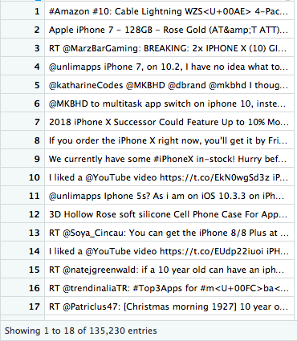
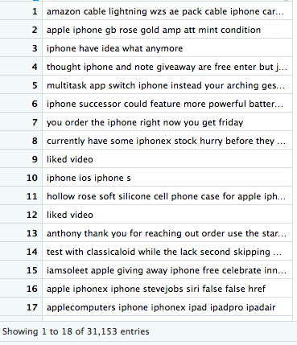

## Project Overview

This repository is intended for the comparison (using sentiment analysis and topic modeling) of the iPhone X and Samsung Galaxy S8 using Twitter data.

- Which phone has the most positive response?
- What are some of the most talked about things about each phone?

## Key Concepts

- Data Wrangling
- Sentiment Analysis
- Topic Modeling (LDA)

---

## 1. Data Wrangling

#### 1.1 Dataset

| Phone              | # Raw Data  | # Cleaned Data  | # Removed Data |
| ------------------ |:-----------:|:---------------:|:--------------:|
| iPhone X           | 135,230     |   31,153        | 104,077        |
| Samsung Galaxy S8  | 144,124     |   34,193        | 109,931        |

#### 1.2 Getting the data

Using Twitter's Search API, I wrote a simple script on R to collect tweets about each phone. Here's an example of how to get tweets about the iPhone X and to store it as a CSV file. A step-by-step explanation on how to collect tweets using the Search API can be found [here](https://medium.com/@ahipolito94/collecting-twitter-data-using-r-cd6cd062dca4).

    #!/usr/local/bin/Rscript
    
    # ---------- SET UP ----------
    setwd("/Users/ahipolito94/Capstone_2/Data")
    library(twitteR)

    setup_twitter_oauth("consumer-key", "consumer-secret",
                    "access-token", "access-secret")

    # ---------- SEARCH TERMS ----------
    iphonex_terms <- c("iphonex", "iPhonex", "iphoneX", "iPhoneX", "iphone10", "iPhone10",
                       "iphone x", "iPhone x", "iphone X", "iPhone X", "iphone 10", "iPhone 10",
                  "#iphonex", "#iPhonex", "#iphoneX", "#iPhoneX", "#iphone10", "#iPhone10")
    iphonex_terms_search <- paste(iphonex_terms, collapse = " OR ")
    iphonex <- searchTwitter(iphonex_terms_search, n=1000, lang="en")
    iphonex <- twListToDF(iphonex)

    # ---------- WRITE/APPEND TO CSV FILE ---------- 
    write.table(iphonex, "/Users/ahipolito94/Capstone_2/Data/iphonex.csv", append=T, row.names=F, col.names=T,  sep=",")

#### 1.3 Before and After Data Wrangling

   

---

Topic Modeling 

    <a target="_blank" title="Open Block a52686c4ca42909a43a1dbac744689aa a new window." href="https://bl.ocks.org/ahipolito94/raw/a52686c4ca42909a43a1dbac744689aa/236da2e30a37b92a454a75e8ed213ec88cb7bd8a/">iPhone X Topics<svg height="16" width="12"><path d="M11 10h1v3c0 0.55-0.45 1-1 1H1c-0.55 0-1-0.45-1-1V3c0-0.55 0.45-1 1-1h3v1H1v10h10V10zM6 2l2.25 2.25-3.25 3.25 1.5 1.5 3.25-3.25 2.25 2.25V2H6z"></path></svg></a>
  

